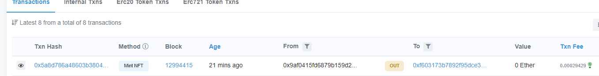
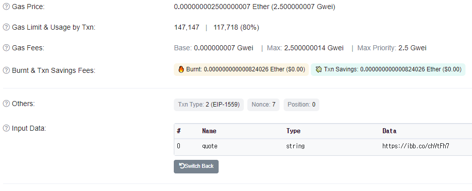

# Smart Contract

**필요한것**

nodejs

Infura.io API key

Metamask Wallet

**과정 정리**
\1. 솔리디티 파일 생성
`truffle create contract [파일명]`
\2. 솔리디티 파일 컴파일하기
`truffle compile`
build/contracts [파일명].json 생성되는 것 확인
\3. 마이그레이션 코드 작성하기
migrations 폴더 안에서 파일 생성
파일명의 규칙은 `[숫자]_[파일명].js`
`truffle migrate`
\4. 테스트 작업
테스트 파일 생성하기
`truffle create test [파일명]`
이후 코드 작성하기
`truffle test`를 통해 테스트 결과를 확인할 수 있다.


**순서**

```
truffle init
npm init
으로 각각 초기화작업 진행
npm install @truffle/hdwallet-provider
npm install @openzeppelin/contracts로 패키지 받아오기
니모닉 단어에서 파생되는 트랜잭션에 사용된다.
```

```
니모닉 시드 가져오는 법
메타마스크-설정-보안 및 개인정보 보호-비밀 복구 구문 공개-비밀번호 입력-복붙
```

```
Infura.io의 api 키 가져오기

Infura.io??
Dapp를 로컬 환경에서 개발할 때는 보통 Truffle에서 제공하는 ganache나 truffle develop을 사용하거나, geth로 private network를 구성해서 사용합니다. 로컬 환경에서 개발이 완료되었다고 판단되면 테스트넷 환경에서 실행 및 테스트를 해봐야 합니다. Infura가 책임지고 이더리움 노드를 제공할테니, 제품/서비스에 집중하라는거죠. 넷별로 Infura 노드의 상태를 실시간으로 확인할 수 있습니다. +버튼을 클릭하면 JSON-RPC, REST, Websocket API로 나눠서 상태를 확인할 수 있고, 각 넷의 응답 시간도 확인할 수 있습니다.

Infura.io 가입
프로젝트 생성
API 키 및 Ropsten endpoint를 가져올 수 있다.
```

```
truffle-config.js 세팅

const HDWalletProvider = require("@truffle/hdwallet-provider");
// require("dotenv").config();
// const { PRIVATE_KEY } = process.env;

const mnemonicPhrase = "{니모닉 지갑 12자리 넣어주기}";

module.exports = {
//    networks: {
//        ganache: {
//            host: "127.0.0.1",
//            port: 8545,
//            network_id: "*",
        },
        ropsten: {
            provider: function () {
                return new HDWalletProvider(mnemonicPhrase, "https://ropsten.infura.io/v3/{API Key}");
            },
            network_id: "3",
        },
    },
    mocha: {},

    compilers: {
        solc: {
            version: "0.8.7",
            settings: {
                evmVersion: "london",
            },
        },
    },
};
```

```
/Contracts 폴더 안 MyNFTs.sol
// SPDX-License-Identifier: MIT
pragma solidity ^0.8.17; //버전은 본인에 맞게

import "@openzeppelin/contracts/token/ERC721/ERC721.sol";
//만약 경로 에러가 생긴다면 ./ 이나 ../등을 사용하여 설정해주자
import "@openzeppelin/contracts/utils/Counters.sol";
import "@openzeppelin/contracts/access/Ownable.sol";
import "@openzeppelin/contracts/token/ERC721/extensions/ERC721URIStorage.sol";

contract MyNFTs is ERC721URIStorage, Ownable {
    using Counters for Counters.Counter;
    Counters.Counter private _tokenIds;

    constructor() public ERC721("MyNFTs", "MNFT") {}

    function mintNFT(string memory tokenURI) //기본코드인 address recipient은 삭제
        public onlyOwner
        returns (uint256)
    {
        _tokenIds.increment();

        uint256 newItemId = _tokenIds.current();
        _mint(msg.sender, newItemId); //recipient를 msg.sender로 대체
        _setTokenURI(newItemId, tokenURI);

        return newItemId;
    }
}
```

```
만약 /Contracts폴더 안에 Migrations.sol이 없다면 생성해주자
pragma solidity ^0.8.17;

contract Migrations {
  address public owner;
  uint256 public last_completed_migration;

  modifier restricted() {
    if (msg.sender == owner) _;
  }

  constructor() public {
    owner = msg.sender;
  }

  function setCompleted(uint completed) public restricted {
    last_completed_migration = completed;
  }

  function upgrade(address new_address) public restricted {
    Migrations upgraded = Migrations(new_address);
    upgraded.setCompleted(last_completed_migration);
  }
}
```

```
migration폴더 안 1_initial_migrations.js 생성
const Migrations = artifacts.require("Migrations");
const MyNFTs = artifacts.require("MyNFTs.sol"); // MyNFTs.sol 파일 추가

module.exports = function (deployer) {
    deployer.deploy(Migrations);
    deployer.deploy(MyNFTs); // MyNFTs를 배포에 추가
};
```

```
테스트넷 배포
truffle migrate --compile-all --network ropsten
```

```
NFT 제조
truffle console --network ropsten으로 테스트넷 진입
FirstNFT = await MyNFTs.deployed()
FirstNFT.name()//이름 확인
FirstNFT.symbol()//심벌 확인
FirstNFT.mintNFT("https://ibb.co/chVtFh7")//url뿐 아니라 json파일 등 메타데이터도 입력 가능

```

```
이더스캔에서 확인
https://ropsten.etherscan.io/ 
본인 메타마스크 주소로 검색

```





